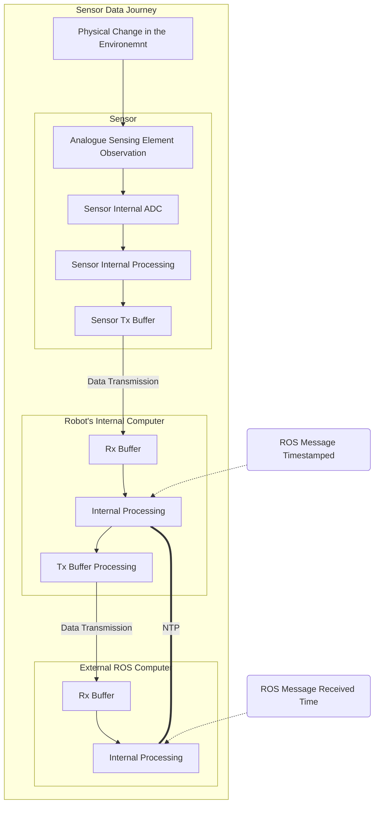

# topic_latency_test
## Overview
Package to test the reliability and latency of a ROS system in two ways.
1. comparing the send and receive times of a message for a given topic
2. evaluating the time for a /cmd_vel packet sent to be acted upon and that command then observed in /odom

## Details for 1.
This test includes delays due to:
- clock differences between the computers
- network latency
- latency between the header timestamp being populated and any other operations prior to it being sent (populating other fields etc.)
- queuing of messages on the receiver
- note that this list is not exhaustive

This test does not explicitly include delays due to:
- internal data acquisition on the robot's internal computer
- transit between the sensor and the robot's internal computer
- software operations prior to the header timestamp being populated on the robot's computer
- note that this list is not exhaustive

The above inclusions and exclusions can be represented by the following diagram.


## Details for 2.


## Installation
I would strongly advise that all system clocks are synchronised using a NTP, GNSS time or similar. I would recommend [Chrony](https://chrony-project.org/).

Clone this repository and the iiwa_stack into your catkin_ws/src and build.
```bash
git clone https://github.com/MShields1986/topic_latency_test.git
git clone https://github.com/IFL-CAMP/iiwa_stack # TODO: remove this dep
cd ..
catkin build
```

## Usage

## Bugs, Issues and Feature Requests

