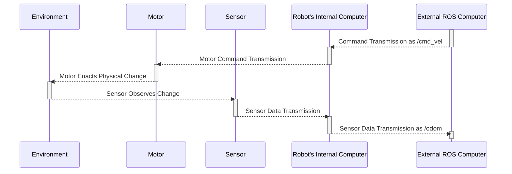

# topic_latency_test
## Overview
Package to test the reliability and latency of a ROS system in two ways.
1. comparing the send and receive times of a message for a given topic
2. evaluating the time for a /cmd_vel packet sent to be acted upon and that command then observed in /odom

## Details for 1.
This test 

This test includes delays due to:
- clock differences between the computers
- network latency
- latency between the header timestamp being populated and any other operations prior to it being sent (populating other fields etc.)
- queuing of messages on the receiver
- note that this list is not exhaustive

This test does not explicitly include delays due to:
- internal data acquisition on the robot's internal computer
- transit between the sensor and the robot's internal computer
- software operations prior to the header timestamp being populated on the robot's computer
- note that this list is not exhaustive

The above inclusions and exclusions can be represented by the following diagram.


## Details for 2.
This test tries to give an idea of the time it takes for a command, /cmd_vel, to be acted upon and observed by the robot in the /odom topic. This is useful for evaluating an lower bound for control loop time and the drive system's performance. There are many better ways to achieve real-time performance with ROS, as such this tool is designed for prototyping and research purposes only, whilst trying to have application across a wide range of mobile robots by utilising the common nav_stack topics.


An extension and simplification of the diagram above is provided below to show the exgtension for the control loop being evaluated. Note that on this test we do not look at the internal message time stamps, rather we record the sent and received times on the "External ROS Computer" running the node provided in this repository, as such this test is less reliant on clock synchronisation.



## Installation
If you intend to run Test 1. I would strongly advise that all system clocks are synchronised using a NTP, GNSS time or similar. I would recommend [Chrony](https://chrony-project.org/). You should probably do this regardless whilst operating a distributed system.

Clone this repository and the iiwa_stack into your catkin_ws/src and build.
```bash
git clone https://github.com/MShields1986/topic_latency_test.git
git clone https://github.com/IFL-CAMP/iiwa_stack # TODO: remove this dep
cd ..
catkin build
```

## Usage
### Test 1.


### Test 2.


### Results and Processing
Logs are recorded in the `data` directory and there are some helper scripts to plot the logs provided in the `scripts` directory.

## Bugs, Issues and Feature Requests
Please report bugs, issues and request features using the [Issue Tracker](https://github.com/MShields1986/topic_latency_test/issues).
